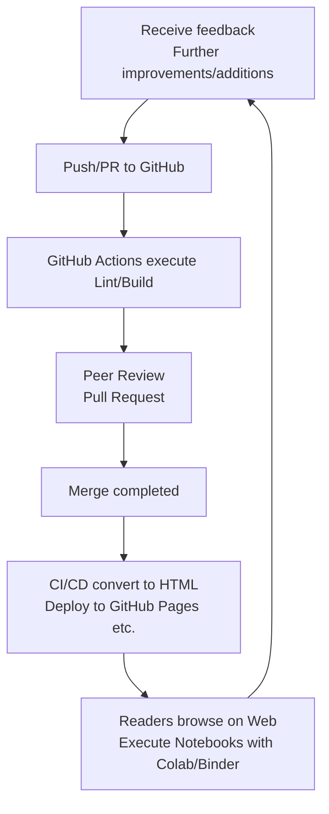

# Chemistry-Relativity-QM-Book

This is an open-source textbook project for chemistry based on relativity theory, quantum mechanics, particle physics, and thermodynamics.

## Structure

```markdown
# Repository Structure

Chemistry-Relativity-QM-Book/
├── README.md
├── LICENSE
├── docs/
│   ├── 00_Introduction.md
│   ├── 01_Basics_of_Relativity.md
│   ├── 02_Quantum_Mechanics_Primer.md
│   ├── 03_Particle_Physics_and_Atomic_Structure.md
│   ├── 04_Thermodynamics_Foundations.md
│   ├── 05_Chemical_Bonding_in_Relativistic_Contexts.md
│   ├── 06_Quantum_Chemistry_Basics.md
│   ├── 07_Particle_Interactions_in_Chemical_Reactions.md
│   ├── 08_Relativistic_Effects_in_Heavy_Elements.md
│   ├── 09_Advanced_Thermodynamics_for_Chemistry.md
│   ├── 10_Summary_and_Future_Perspectives.md
│   └── references/
│       ├── reference_list.md
│       └── external_links.md
├── examples/
│   ├── experiment_simulations/
│   │   ├── quantum_sim_1.ipynb
│   │   └── thermo_sim_1.ipynb
│   ├── sample_chapters/
│   │   └── advanced_topic_example.md
│   └── figures/
│       ├── relativity_diagram.png
│       ├── quantum_well_diagram.svg
│       └── ...
├── exercises/
│   ├── ch01_exercises.md
│   ├── ch01_exercises.ipynb
│   ├── ch02_exercises.md
│   ├── ch02_exercises.ipynb
│   ├── ...
│   └── solutions/
│       ├── ch01_solutions.md
│       ├── ch02_solutions.md
│       └── ...
├── translations/
│   ├── en/
│   │   ├── 01_Basics_of_Relativity_en.md
│   │   ├── ...
│   └── ...
└── .github/
    ├── ISSUE_TEMPLATE/
    │   └── chapter_issue_template.md
    └── PULL_REQUEST_TEMPLATE.md
```

- `README.md`: Repository overview
- `LICENSE`: License (e.g., CC-BY or MIT)
- `docs/`: Textbook content and related materials
- `examples/`: Simulations and sample code
- `exercises/`: Exercises (.md / .ipynb) and solutions
- `translations/`: Files for internationalization
- `.github/`: Community operation templates

## Architecture



Generated by Mermaid.

## Design

The CSS design is provided in PROMPT.md.

## Critique & Proposals

1. **Gradual Difficulty Adjustment**
   - Prepare visual materials and storylines that are easy for junior high school students to understand when dealing with relativity and quantum mechanics.
   - Maintain interest by incorporating experimental examples and historical episodes before 본격적으로 developing mathematical formulas.

2. **Merits and Risks of Using GitHub**
   - Make it easy to run `.ipynb` files in conjunction with Binder/Colab to lower the hurdle of environment construction.
   - Consider using `nbstripout` to avoid committing unnecessary meta-information and prevent version control confusion.

3. **Community Formation**
   - Create a mechanism that allows junior high school students to easily write in Issues and Discussions, and improve the教材 interactively.
   - Promote the development of English translations and other language versions to function as international learning resources.
